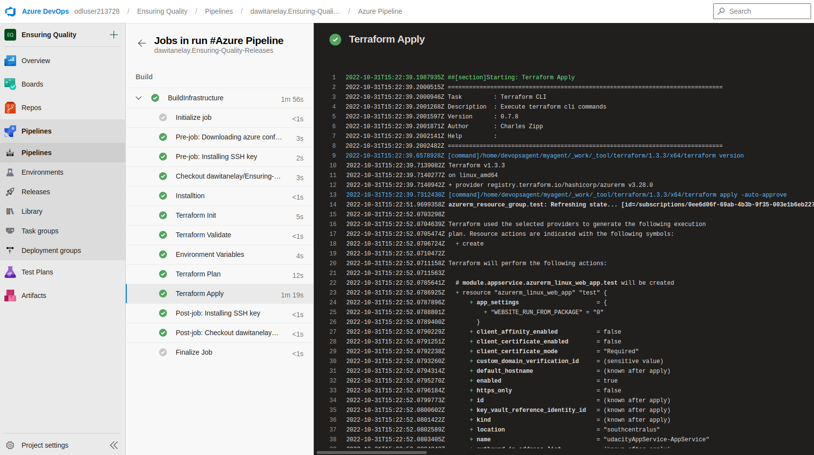

## Architectural Diagram

## Dependencies
1. Azure DevOps
2. Install latest version [Terraform](https://www.terraform.io/downloads.html)
3. Install  latest version [JMeter](https://jmeter.apache.org/download_jmeter.cgi)
4. Install latest version [Postman](https://www.postman.com/downloads/)
5. Install latest version [Selenium](https://sites.google.com/a/chromium.org/chromedriver/getting-started)
6. Python
7. Install  latest version  [Azure command line interface](https://docs.microsoft.com/en-us/cli/azure/install-azure-cli?view=azure-cli-latest)

## Output
### BuildInfrastructure

