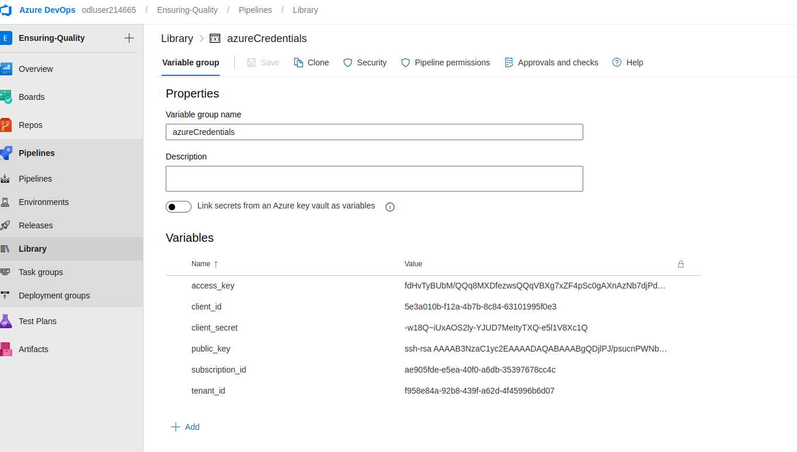
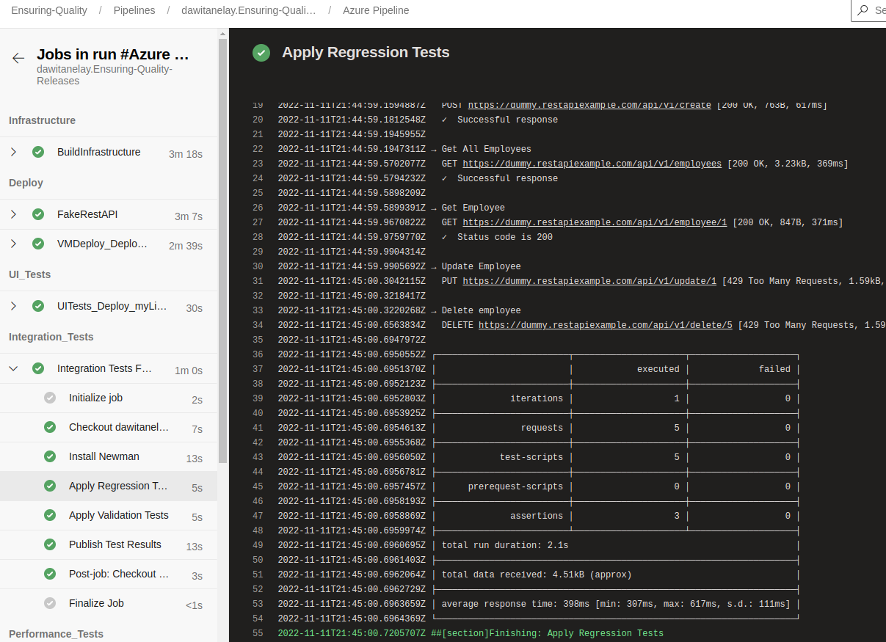

## Architectural Diagram

## Dependencies
1. Azure DevOps
2. Install latest version [Terraform](https://www.terraform.io/downloads.html)
3. Install  latest version [JMeter](https://jmeter.apache.org/download_jmeter.cgi)
4. Install latest version [Postman](https://www.postman.com/downloads/)
5. Install latest version [Selenium](https://sites.google.com/a/chromium.org/chromedriver/getting-started)
6. Python
7. Install  latest version  [Azure command line interface](https://docs.microsoft.com/en-us/cli/azure/install-azure-cli?view=azure-cli-latest)

## Getting Started
1 Clone this repository

2 Login into your azure account: `az login -u "username" -p "password"`

3 Create service principal or use the one you already have:

4 `cd /terraform/environments/test && bash configure-tfstate-storage-account.sh`

5 Make an `azureCredentials.conf` file that contains variables to be uploaded and used as group variables in pipline.
 The file looks like this:
  ```
  storage_account_name = "tfstate1216731519"
  container_name       = "tfstate"
  key                  = "terraform.tfstate"
  access_key           = "fdHvTyBUbM/QQq8MXDfezwsQQqVBXg7xZF4pSc0gAXnAzNb7djPd0gA+0LLQCNkPa2QQiXBlnkzB+ASt9z9jnQ=="

Azure subscription vars
subscription_id = "ae905fde-e5ea-40f0-a6db-35397678cc4c"
client_id = "5e3a010b-f12a-4b7b-8c84-63101995f0e3"
client_secret = "-w18Q~iUxAOS2ly-YJUD7MeItyTXQ-e5l1V8Xc1Q"
tenant_id = "f958e84a-92b8-439f-a62d-4f45996b6d07"
```
6 Create ssh key 
```
 ssh-keygen -t rsa 
```
7 Update the following fields in main.tf and/or terraform.tfvars file.
| parameter| Link |
| ------ | ------ |
| subscription_id | subscription id |
| client_id | service principal client app id |
| client_secret | service principal password |
| tenant_id | service principal tenandt id |
| location | location |
| resource_group | Resource Group |
| application_type | Name of the APP - must be unique |
| virtual_network_name | Name of the VNet |
| public_key_path | path of the id_rsa.pub file |

8 Login to azure DevOps organization.

9 Create a service connection

10 Create self-host Agent Pool: Follow the step [Azure pipeline agent Here](https://github.com/dawitanelay/Azure-Devops-Building-CI-CD-Pipeline/blob/aa7ac4b8b6053b2aa1bf9788b6945877473d85b7/Azure%20Pipeline%20Agent.pdf)

11 Install the following on the Agent pool 
```
sudo apt-get -y install zip 
curl -sL https://aka.ms/InstallAzureCLIDeb | sudo bash 
sudo apt-get install npm 
```
12 Create a new pipeline.
  - Select you GitHub repository.
  - Select azure pipelines YAML file
  
13 Create a new environment.


14 From the environment select the VM created from terraform apply. Log into the VM with and paste the registration script
```
 ssh username@publicIP 
 ```
15 From Pipeline create a variable group and upload the file 


16 Run the pipeline.
 - Successful pipeline run
 
 
## Output
### Build Infrastructure


## Automated Testing
### Jmeter
1 Endurance Testing 


2 
###  Postman
Regression test
 
 
Validation test

Publish test result


### Selenium


## Monitoring & Observability
[Create alart ](https://learn.microsoft.com/en-us/azure/azure-monitor/alerts/alerts-create-new-alert-rule?tabs=metric)

Copy the app service url and https://udacity-appservice.azurewebsites.net/L. This will create a 404 error and triger the email.


Set up log analytics workspace properly to get logs: Go to Virtual Machines and Connect the VM created on Terraform to the Workspace.

Set up custom logging , in the log analytics workspace go to. In this case custom log name is UI_Test_Log_CL.

Custom Logs > Add + > Choose File. Select the file selenium-test.log > Next > Put in the following paths as type Linux: /var/log/selenium/selenium-test.log.

